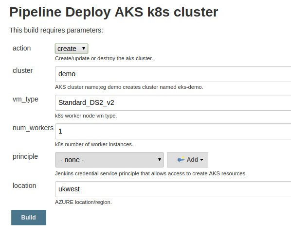

# Introduction

Create an azure kubernetes cluster (`aks`) by running a Jenkins pipeline.

Official instructions are [here](https://docs.microsoft.com/en-us/azure/aks/kubernetes-walkthrough).

Since creating an `aks` is fairly simple with the `az` cli, there is no need to use something like terraform or a resource manager template.

This pipeline does not create a service principle for the `aks` cluster; instead the service principle used to run the Jenkins job is used. This means we don't need to cleanup the service principle when the `aks` cluster is destroyed.

# Credentials for azure

Pipeline uses a service principle (sp) with a secret. You can create this via the `az` command line or via the Azure portal.

The `az` cli setup is described [here](https://www.terraform.io/docs/providers/azurerm/auth/service_principal_client_secret.html).

The Azure portal setup is described [here](https://docs.microsoft.com/en-gb/azure/active-directory/develop/howto-create-service-principal-portal).

Role `Contributor` is sufficient to deploy `aks` (but its not sufficient if a sp is also to be created).

Add the sp as a Jenkins credential using Kind `Microsoft Azure Service Principle`; this will require the `Azure Credentials` Jenkins plugin.

# Running the pipeline

Just create a Pipeline in Jenkins and point it at a git repo where this code is hosted. 

Specify `Jenkinsfile` to be used as the jenkinsfile.

You have the choice of Create or Destroy. Note there is no confirmation, so be aware when you run the job (you could use an `input` command for confirmation).

As mentioned in the last section, a credential using a service principle is required to access your Azure account to do the deployment.

Parameters that can be specified: .

# Accessing the aks cluster from kubectl

`kubectl` is the kubernetes client. You should be able to install it via your package manager on your operating system.

The Create Jenkins console output will list what should be included in your `~/.kube/config` file to access the cluster. Cut and paste this to the file. Note that this is based on using the same credentials on Jenkins and your client.

Alternativly, if using different credentials, use the following to get your kube config (cluster name and resource group name are the same):

```
$ az aks get-credentials --name <cluster-name> --resource-group <resource-grp-name> --file -
```

Then confirm you can see everything deployed in the cluster:

```
$ kubectl get all --all-namespaces
NAMESPACE     NAME                                       READY     STATUS    RESTARTS   AGE
kube-system   pod/heapster-779db6bd48-msr5k              2/2       Running   0          29m
kube-system   pod/kube-dns-autoscaler-5b94d96445-8fq72   1/1       Running   0          29m
kube-system   pod/kube-dns-v20-6df5d5c657-l9s86          4/4       Running   0          29m
kube-system   pod/kube-dns-v20-6df5d5c657-ql2ct          4/4       Running   0          25m
kube-system   pod/kube-proxy-p6psh                       1/1       Running   0          26m
kube-system   pod/kube-svc-redirect-v82q9                2/2       Running   0          26m
kube-system   pod/kubernetes-dashboard-f49587769-8vsc4   1/1       Running   0          29m
kube-system   pod/omsagent-rs-6bff76b989-9vq6l           1/1       Running   1          29m
kube-system   pod/omsagent-vw8pq                         1/1       Running   1          26m
kube-system   pod/tunnelfront-647668f595-k5k68           1/1       Running   0          29m

NAMESPACE     NAME                           TYPE        CLUSTER-IP     EXTERNAL-IP   PORT(S)         AGE
default       service/kubernetes             ClusterIP   10.0.0.1       <none>        443/TCP         30m
kube-system   service/heapster               ClusterIP   10.0.220.186   <none>        80/TCP          29m
kube-system   service/kube-dns               ClusterIP   10.0.0.10      <none>        53/UDP,53/TCP   29m
kube-system   service/kubernetes-dashboard   ClusterIP   10.0.171.218   <none>        80/TCP          29m

NAMESPACE     NAME                                     DESIRED   CURRENT   READY     UP-TO-DATE   AVAILABLE   NODE SELECTOR                 AGE
kube-system   daemonset.extensions/kube-proxy          1         1         1         1            1           beta.kubernetes.io/os=linux   29m
kube-system   daemonset.extensions/kube-svc-redirect   1         1         1         1            1           beta.kubernetes.io/os=linux   29m
kube-system   daemonset.extensions/omsagent            1         1         1         1            1           beta.kubernetes.io/os=linux   29m

NAMESPACE     NAME                                         DESIRED   CURRENT   UP-TO-DATE   AVAILABLE   AGE
kube-system   deployment.extensions/heapster               1         1         1            1           29m
kube-system   deployment.extensions/kube-dns-autoscaler    1         1         1            1           29m
kube-system   deployment.extensions/kube-dns-v20           2         2         2            2           29m
kube-system   deployment.extensions/kubernetes-dashboard   1         1         1            1           29m
kube-system   deployment.extensions/omsagent-rs            1         1         1            1           29m
kube-system   deployment.extensions/tunnelfront            1         1         1            1           29m

NAMESPACE     NAME                                                   DESIRED   CURRENT   READY     AGE
kube-system   replicaset.extensions/heapster-779db6bd48              1         1         1         29m
kube-system   replicaset.extensions/kube-dns-autoscaler-5b94d96445   1         1         1         29m
kube-system   replicaset.extensions/kube-dns-v20-6df5d5c657          2         2         2         29m
kube-system   replicaset.extensions/kubernetes-dashboard-f49587769   1         1         1         29m
kube-system   replicaset.extensions/omsagent-rs-6bff76b989           1         1         1         29m
kube-system   replicaset.extensions/tunnelfront-647668f595           1         1         1         29m

NAMESPACE     NAME                               DESIRED   CURRENT   READY     UP-TO-DATE   AVAILABLE   NODE SELECTOR                 AGE
kube-system   daemonset.apps/kube-proxy          1         1         1         1            1           beta.kubernetes.io/os=linux   29m
kube-system   daemonset.apps/kube-svc-redirect   1         1         1         1            1           beta.kubernetes.io/os=linux   29m
kube-system   daemonset.apps/omsagent            1         1         1         1            1           beta.kubernetes.io/os=linux   29m

NAMESPACE     NAME                                   DESIRED   CURRENT   UP-TO-DATE   AVAILABLE   AGE
kube-system   deployment.apps/heapster               1         1         1            1           29m
kube-system   deployment.apps/kube-dns-autoscaler    1         1         1            1           29m
kube-system   deployment.apps/kube-dns-v20           2         2         2            2           29m
kube-system   deployment.apps/kubernetes-dashboard   1         1         1            1           29m
kube-system   deployment.apps/omsagent-rs            1         1         1            1           29m
kube-system   deployment.apps/tunnelfront            1         1         1            1           29m

NAMESPACE     NAME                                             DESIRED   CURRENT   READY     AGE
kube-system   replicaset.apps/heapster-779db6bd48              1         1         1         29m
kube-system   replicaset.apps/kube-dns-autoscaler-5b94d96445   1         1         1         29m
kube-system   replicaset.apps/kube-dns-v20-6df5d5c657          2         2         2         29m
kube-system   replicaset.apps/kubernetes-dashboard-f49587769   1         1         1         29m
kube-system   replicaset.apps/omsagent-rs-6bff76b989           1         1         1         29m
kube-system   replicaset.apps/tunnelfront-647668f595           1         1         1         29m
```

Check the worker nodes deployed:

```
$ kubectl get nodes
NAME                       STATUS    ROLES     AGE       VERSION
aks-nodepool1-26648723-0   Ready     agent     27m       v1.9.11
```

# Where next

`aks` is a fairly simple to deploy. However there is much more to `aks'. Head over the Azure [docs](https://docs.microsoft.com/en-us/azure/aks/kubernetes-walkthrough).
